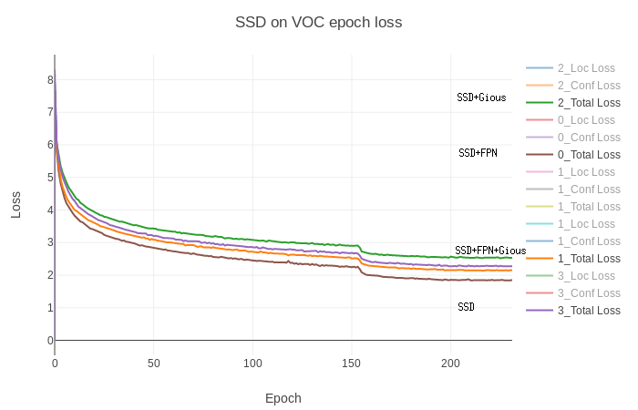

# SSD_FPN_GIoU, in PyTorch
This is a SSD experiment reposity, the purpose is to reproduce some related papers based on SSD
The code references [SSD: Single Shot MultiBox Object Detector, in PyTorch](https://github.com/amdegroot/ssd.pytorch) and [mmdet](https://github.com/open-mmlab/mmdetection). Currently, some experiments are carried out on the VOC dataset, if you want to train your own dataset, you can refer to the part of training-yourself-dataset.

### Table of Contents
- <a href='#Folder_Structure'>Folder</a>
- <a href='#Environment'>Installation</a>
- <a href='#Datasets'>Datasets</a>
- <a href='#Training'>Train</a>
- <a href='#Evaluation'>Evaluate</a>
- <a href='#Test'>Test</a>
- <a href='#Performance'>Performance</a>
- <a href='#Autor'>Autor</a>
- <a href='#References'>Reference</a>

&nbsp;
&nbsp;
&nbsp;
&nbsp;

## Fold-Structure
The fold structure as follow:
- config/
	- config.py
	- __init__.py
- data/
	- __init__.py
 	- VOC.py
	- VOCdevkit/
- model/
	- build_ssd.py
	- __init__.py
	- backbone/
	- neck/
	- head/
	- utils/
- utils/
	- box/
	- detection/
	- loss/
	- __init__.py
- tools/
	- train.py
	- eval.py
	- test.py
- work_dir/
	

## environment
- pytorch 0.4.1
- python3+
- visdom 
for real-time loss visualization during training!
  ```Shell
  pip install visdom
Start the server (probably in a screen or tmux)
  python visdom
  ```
  * Then (during training) navigate to http://localhost:8097/ (see the Train section below for training details).


## Datasets
- PASCAL VOC:To make the dataset, now you can download the voc 07+12, can take the VOCdevkit in the data/


## Training

### Training VOC
- The pretrained model refer [pretrained-models.pytorch](https://github.com/Cadene/pretrained-models.pytorch),you can download the model.

-in the SSD_FPN_GIoU fold:
```Shell
python tools/train.py
```

- Note:
  * For training, default NVIDIA GPU.
  * You can set the parameters in the train.py (see 'tools/train.py` for options) 
  * In the config,you can set the work_dir to save your training weight.(see 'configs/config.py`) 


### Training yourself dataset
- if you want to trainning yourself dataset, there are some steps:
1. you need to make the dataset refer the VOC dataset, and take it to data/
2. in the data/ ,you need make yourself-data.py, for example CRACK.py(it is my dataset), and change it according to your dataset. Also,in the __init__.py you can write something about your dataset
3. change the config/ config.py, and make your dataset config,like CRACK(dict{})
4. In the main,load your dataset.

- in the SSD_FPN_GIoU fold:
```Shell
python tools/train.py
```


## Evaluation
- To evaluate a trained network:

```Shell
python eval.py --trained_model **your weight add**
```

## Test
- To test a trained network:

```Shell
python test.py -- trained_model **your weight add**
```
if you want to visual the box, you can add the command --visbox True(default False)

## Performance

### VOC2007 Test mAP
- Backbone is the ResNet50
| Test |mAP(iou=0.5)|mAP(iou=0.6)|mAP(iou=0.75)|
|:-:|:-:|:-:|:-:|
| SSD | 75.49% | 70.87% | 53.44 % |
| SSD+Gious | 76.09% | 71.01% | 54.70 % |
| SSD+FPN | 78.99% | 73.18% | 55.19 % |
| SSD+FPN+Gious | 78.96% | 73.35% | 55.83 % |



### FPS
- SSD+FPN+Gious:
**GTX 1080ti:** ~35 FPS

### Download a pre-trained network
- Currently, we provide the following PyTorch models:
    * SSD300 trained on VOC0712 (newest PyTorch SSD+FPN+Gious weights)
	- [Baidu DRIVE-raw.tar.gz](https://pan.baidu.com/s/1Z4oYk0ni_Tocj8xJzglzFA) , **passward:**32wv


## Authors
* [**JavierHuang**](https://github.com/JaryHuang)

## References
- [SSD: Single Shot MultiBox Detector](http://arxiv.org/abs/1512.02325)
- [SSD: Single Shot MultiBox Object Detector, in PyTorch](https://github.com/amdegroot/ssd.pytorch)
- [mmdet](https://github.com/open-mmlab/mmdetection)
- [Feature Pyramid Networks for Object Detection](https://arxiv.org/abs/1612.03144)
- [Focal Loss for Dense Object Detection](https://arxiv.org/abs/1708.02002)
- [Generalized Intersection over Union](https://arxiv.org/abs/1902.09630)
